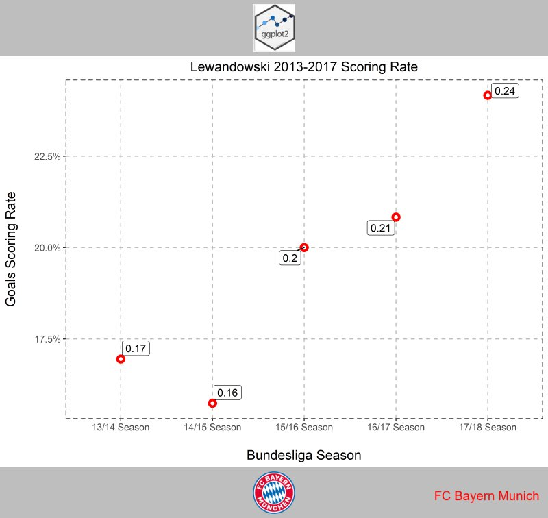
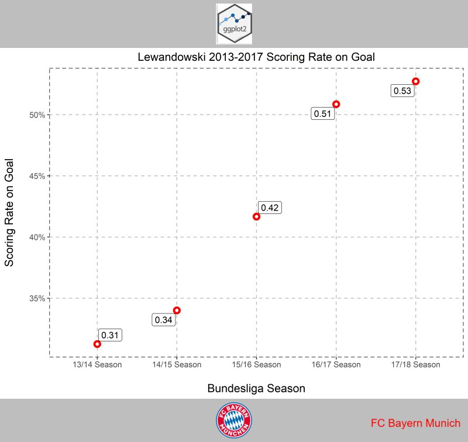
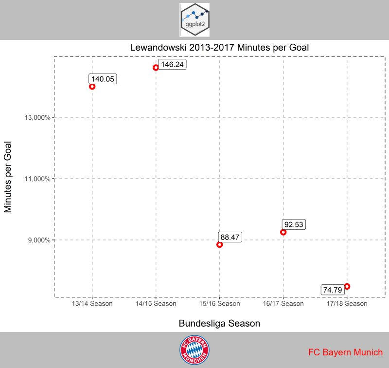
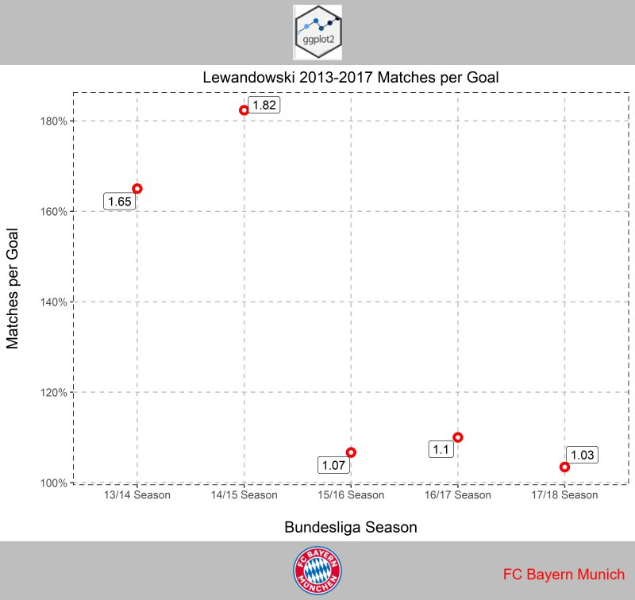

#__**Football Analysis Using R for FC Bayern Munich**__
## This project currently adopts R's tidyverse package as its main analysis tool

**Load Library**

```{r setup, results='hide'}
library(tidyverse)
library(ggrepel)
library(magick)
```

**__1. Introduction__** This is the R Markdown 

In this analysis, we are going to use the csv file called "bundesliga_team_stats_standard_2013_18", 
which I scraped down from Foxsports. I hereby confirm that this dataset will only be used for educational
purposes, and by no means, used for commercial purposes. If requested, I will delete the scraped dataset.

So to further understand what this dataset contains, let's take a look at it. 

```{r readData, results='hide'}
bundesliga <- read_csv("Data/bundesliga_team_stats_standard_2013_18.csv", col_names = TRUE, locale = locale(encoding = "latin1"))
```

```{r bundesliga_table}
knitr::kable(
  bundesliga[1:10, ],
  caption = "Bundesliga Dataset"
)
```


So we can see that the dataset contains `r ncol(bundesliga)` columns and `r nrow(bundesliga)` rows. When scraping
the dataset, I only included the current 2018/19 new seasons' teams, which means, the two demoted HSV Hamburg and 
FC Köln are not included. However, Fortuna Düsseldorf and 1. FC Nürnberg's data format doesn't match with the other
teams, therefore, their data, which only contains the statistics in Bundesliga 2, are also not included. This leaves
us with the following teams:

```{r clubs}
club <- bundesliga["Team"]
club <- unique(club)
knitr::kable(club, caption = "Teams included in the Data")
```

The dataset, contains all these 16 teams' Bundesliga performance. This means, if one of these teams had been demoted to
Bundesliga 2 during 2013 to 2017, the data in the Bundesliga 2 period will not be included here.

**__2. Data Wrangling__** Cleaning the data and extract information

Suppose we are interested in the performance of Lewandowski during the 2013/14 season to 2017/18 season. We know that he
used to play for Borussia Dortmund before he transferred to FC Bayern Munich. Since we also included Borussia Dortmund's data
here, we can simply filter out the data that contains Lewandowski's name.

```{r Lewandowski}
lewandowski <- bundesliga %>% 
  filter(Name == 'Lewandowski, Robert') %>% 
  # We cannot use the original Season column to make sorting,
  # So I separate the Season variable into Season_start and Season_end
  # and then arranged the dataset using Season_start
  # We do not want to remove the original column, so set remove = FALSE
  # Keep the original Season column as a name that we want to use later
  separate(Season, into = c("Season_start", "Season_end"), sep = "/", remove = FALSE) %>% 
  arrange(Season_start) %>% 
  # I have strong interests in Lewandowski's performance such as scoring
  # rate out of shots attemped, scoring rate out of shots_on_goal, and also
  # minutes played per goal and so on. Use mutate to create these variables.
  mutate(scoring_rate = Goals / Shots,
         scoring_rate_on_goal = Goals / Shots_On_Goal,
         min_per_goal = Minutes_Played / Goals,
         matches_per_goal = Games_Played / Goals
         )

lewan_temp <- lewandowski %>% 
  select(Season, Team, Name, scoring_rate, scoring_rate_on_goal, min_per_goal, matches_per_goal)
knitr::kable(lewan_temp,
             caption = "Lewandowski's Dataset")
```

Now I have mutated the original "lewandowski" dataset that I extracted from the "bundesliga" dataset. The
variables added are:

1. **_scoring_rate_**: The number of goals scored out of the total number of shots made:
2. **_scoring_rate_on_goal_**: The number of goals scored out of total number of shots on goal
3. **_goals_per_min_**: The number of goals per minute played in the match
4. **_goals_per_match_**: The number of goals per match played

These newly added variables will help us understand Lewandowski's scoring efficiency as a striker.

```{r lewanPlot, eval=FALSE}
# Insert images ggplot2
logo_ggplot2 <- image_read("Images/Bayern_Munich/ggplot2.jpg")
logo <- logo_ggplot2 %>%
  image_scale("100") %>% 
  image_background("grey", flatten = TRUE) %>%
  image_border("grey", "600x10") %>%
  image_annotate("Powered By R", color = "grey", size = 30, 
                 location = "+10+50", gravity = "northeast")

# Insert images FC Bayern Munich

logo_bayern <- image_read("Images/Bayern_Munich/fcb_logo.png")
logo_bayern_final <- logo_bayern %>% 
   image_scale("100") %>% 
   image_background("grey", flatten = TRUE) %>% 
   image_border("grey", "600x10") %>% 
   image_annotate("FC Bayern Munich", color = "red", size = 30,
                  location = "+20+50", gravity= "northeast")

```

Making the plot:

```{r scoring_rate}
# Scoring Rate Lewandowski

scoring_rate_Lewan <- ggplot(lewandowski, aes(Season, scoring_rate)) +
  geom_point(shape = 21, size = 2, color = "red", fill = "white", stroke = 2) +
  scale_x_discrete("\nBundesliga Season", label = c("13/14 Season", "14/15 Season", "15/16 Season", "16/17 Season", "17/18 Season")) +
  scale_y_continuous("Goals Scoring Rate\n", labels = scales::percent ) +
  labs(title = "Lewandowski 2013-2017 Scoring Rate") +
  theme(plot.title = element_text(size = 14, hjust = 0.5, family = "sans"),
        axis.title = element_text(size = 14, family = "sans"),
        axis.text = element_text(size = 10),
        panel.background = element_rect(fill = NA),
        panel.border = element_rect(linetype = "dashed", fill = NA),
        panel.grid.major = element_line(linetype = "dashed", size = 0.5, color = "grey")) + 
  geom_label_repel(aes(label = round(scoring_rate,2), 
                       box.padding = 2,
                       point.padding = 2, 
                       segment.colour = "grey"))
scoring_rate_Lewan

scoring_rate_Lewan + ggsave(filename = "Images/Bayern_Munich/scoring_rate_Lewan.png",
              width = 8, height = 6, dpi = 500)


```


```{r scoring_rate_png, eval=FALSE}
# Load original main plot
plot_Lewan <- image_read("Images/Bayern_Munich/scoring_rate_Lewan.png")

# Combine plots together
lewan_scoring_final <- image_append(image_scale(c(logo, plot_Lewan, logo_bayern_final), "800"), stack = TRUE)

# Save and overwrite the original lewan_main plot
image_write(lewan_scoring_final, "Images/Bayern_Munich/scoring_rate_Lewan.png")
```


The final plot looks like this:

```{r scoring_rate_finalplot}

```


```{r scoring_rate_on_goal}
scoring_rate_on_goal_Lewan <- ggplot(lewandowski, aes(Season, scoring_rate_on_goal)) +
  geom_point(shape = 21, size = 2, color = "red", fill = "white", stroke = 2) +
  scale_x_discrete("\nBundesliga Season", label = c("13/14 Season", "14/15 Season", "15/16 Season", "16/17 Season", "17/18 Season")) +
  scale_y_continuous("Scoring Rate on Goal\n", labels = scales::percent ) +
  labs(title = "Lewandowski 2013-2017 Scoring Rate on Goal") +
  theme(plot.title = element_text(size = 14, hjust = 0.5, family = "sans"),
        axis.title = element_text(size = 14, family = "sans"),
        axis.text = element_text(size = 10),
        panel.background = element_rect(fill = NA),
        panel.border = element_rect(linetype = "dashed", fill = NA),
        panel.grid.major = element_line(linetype = "dashed", size = 0.5, color = "grey")) + 
  geom_label_repel(aes(label = round(scoring_rate_on_goal,2), 
                       box.padding = 2,
                       point.padding = 2, 
                       segment.colour = "grey"))

scoring_rate_on_goal_Lewan

scoring_rate_on_goal_Lewan + ggsave(filename = "Images/Bayern_Munich/scoring_rate_on_goal_Lewan.png",
              width = 8, height = 6, dpi = 500)
```

Let's make the beautified image:

```{r scoring_rate_on_goal_png, eval=FALSE}
# Load original main plot
srog_Lewan <- image_read("Images/Bayern_Munich/scoring_rate_on_goal_Lewan.png")

# Combine plots together
lewan_srog_final <- image_append(image_scale(c(logo, srog_Lewan, logo_bayern_final), "800"), stack = TRUE)

# Save and overwrite the original lewan_main plot
image_write(lewan_srog_final, "Images/Bayern_Munich/scoring_rate_on_goal_Lewan.png")
```

Finally
```{r scoring_rate_on_goal_finalplot}

```

Now let's take a look at the minutes per goal figure:
```{r min_per_goal}
min_per_goal_plot <- ggplot(lewandowski, aes(Season, min_per_goal)) +
  geom_point(shape = 21, size = 2, color = "red", fill = "white", stroke = 2) +
  scale_x_discrete("\nBundesliga Season", label = c("13/14 Season", "14/15 Season", "15/16 Season", "16/17 Season", "17/18 Season")) +
  scale_y_continuous("Minutes per Goal\n", labels = scales::percent ) +
  labs(title = "Lewandowski 2013-2017 Minutes per Goal") +
  theme(plot.title = element_text(size = 14, hjust = 0.5, family = "sans"),
        axis.title = element_text(size = 14, family = "sans"),
        axis.text = element_text(size = 10),
        panel.background = element_rect(fill = NA),
        panel.border = element_rect(linetype = "dashed", fill = NA),
        panel.grid.major = element_line(linetype = "dashed", size = 0.5, color = "grey")) + 
  geom_label_repel(aes(label = round(min_per_goal,2), 
                       box.padding = 2,
                       point.padding = 2, 
                       segment.colour = "grey"))
min_per_goal_plot

min_per_goal_plot + ggsave(filename = "Images/Bayern_Munich/mpg_Lewan.png",
              width = 8, height = 6, dpi = 500)
```

Let's make the beautified image:
```{r mpg_png}
# Load original main plot
mpg_Lewan <- image_read("Images/Bayern_Munich/mpg_Lewan.png")

# Combine plots together
lewan_mpg_final <- image_append(image_scale(c(logo, mpg_Lewan, logo_bayern_final), "800"), stack = TRUE)

# Save and overwrite the original lewan_main plot
image_write(lewan_mpg_final, "Images/Bayern_Munich/mpg_Lewan.png")
```

The plot can be shown as:
```{r mpg_Lewan_finalplot}

```

Finally, let's take a look at matches per goal figure:
```{r matches_per_goal}
matches_per_goal_plot <- ggplot(lewandowski, aes(Season, matches_per_goal)) +
  geom_point(shape = 21, size = 2, color = "red", fill = "white", stroke = 2) +
  scale_x_discrete("\nBundesliga Season", label = c("13/14 Season", "14/15 Season", "15/16 Season", "16/17 Season", "17/18 Season")) +
  scale_y_continuous("Matches per Goal\n", labels = scales::percent ) +
  labs(title = "Lewandowski 2013-2017 Matches per Goal") +
  theme(plot.title = element_text(size = 14, hjust = 0.5, family = "sans"),
        axis.title = element_text(size = 14, family = "sans"),
        axis.text = element_text(size = 10),
        panel.background = element_rect(fill = NA),
        panel.border = element_rect(linetype = "dashed", fill = NA),
        panel.grid.major = element_line(linetype = "dashed", size = 0.5, color = "grey")) + 
  geom_label_repel(aes(label = round(matches_per_goal,2), 
                       box.padding = 2,
                       point.padding = 2, 
                       segment.colour = "grey"))
matches_per_goal_plot

matches_per_goal_plot + ggsave(filename = "Images/Bayern_Munich/matchpg_Lewan.png",
              width = 8, height = 6, dpi = 500)
```

Let's make the png plot for matches per goal:

```{r matches_per_goal_png}
# Load original main plot
matchpg_Lewan <- image_read("Images/Bayern_Munich/matchpg_Lewan.png")

# Combine plots together
lewan_matchpg_final <- image_append(image_scale(c(logo, matchpg_Lewan, logo_bayern_final), "800"), stack = TRUE)

# Save and overwrite the original lewan_main plot
image_write(lewan_matchpg_final, "Images/Bayern_Munich/matchpg_Lewan.png")
```

The final plot looks like this:

```{r matchpg_Lewan_finalplot}

```


Because some unknown error here, I could not save this Rmd file as R Markdown file. But the overall is
like this.

Done, and you can do more if you want.
